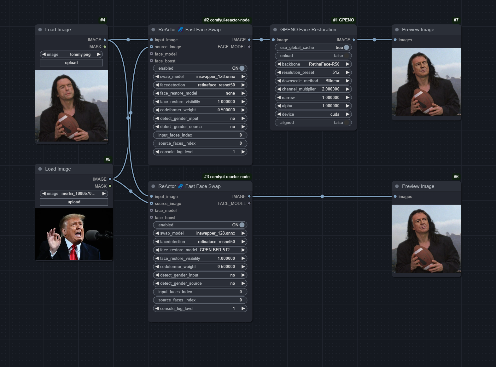

# ComfyUI-GPENO

A node for [ComfyUI](https://github.com/comfyanonymous/ComfyUI) that performs [GPEN face restoration](https://github.com/yangxy/GPEN) on the input image(s). The "O" in "GPENO" stands for "Optimized," as I have implemented various performance improvements that significantly boost speed.

### Installation

Simply drag the image above into ComfyUI and use [ComfyUI Manager » Install Missing Custom Nodes](https://github.com/ltdrdata/ComfyUI-Manager).

> [!NOTE]
> ComfyUI-GPENO will download GPEN dependencies upon first use. The destinations are `comfyui/models/facerestore_models` and `comfyui/models/facedetection`.

### Performance Evaluation

Face restoration is commonly applied as a post-processing step in faceswap workflows. I ran a few tests against the popular [ReActor node](https://github.com/Gourieff/comfyui-reactor-node), which includes both face restoration and GPEN features:

- ReActor end-to-end time using the `GPEN-BFR-512` model for face restoration is about **1.4 seconds** on my GeForce 3090.
- ReActor followed by this GPENO node with the same model takes about **0.7 seconds** - almost exactly 2x speedup for no loss of quality.
- Applying the GPENO node directly to my test images took about **0.5 seconds**.

Note that your inference time will depend on a number of factors, including input resolution, the number of faces in the image and so on. But you can probably expect 2-3x speedup compared to other implementations of GPEN.

### Advantages

Apart from the speed, here are some other reasons why you might want to use GPENO in your projects:

1. It is not coupled with other functions such as faceswap, making it easy to apply to an image without additional processing
2. It uses a global cache, which helps you save VRAM if you have multiple instances of GPENO in your workflow
3. It exposes more controls for interfacing with GPEN than you would typically find in an all-in-one node

### Inputs

- `image`: Image or a list of batch images for processing with GPEN
- `use_global_cache`: If enabled, the model will be loaded once and shared across all instances of this node. This saves VRAM if you are using multiple instances of GPENO in your flow, but the settings must remain the same for all instances.
- `unload`: If enabled, the model will be freed from the cache at the start of this node's execution (if applicable), and it will not be cached again.
- Please refer to the GPEN repository for more information on remaining controls

---

This node was adapted from the `[restore_faces]` shortcode of [Unprompted](https://github.com/ThereforeGames/unprompted), my Automatic1111 extension.